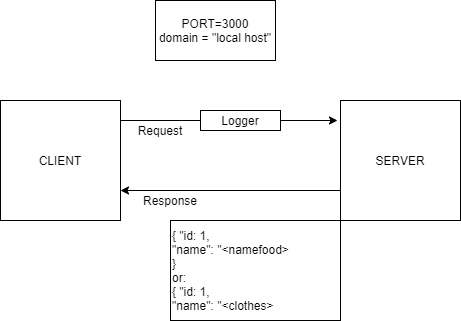

# LAB - CLass 03 - basic-api-server

## Project: Express REST API

### Links and Resources

### Setup

.env requirements

+ PORT - 3000

### How to initialize/run your application

+ npm start (or) nodemon

Endpoint:


```
In Terminal
+ HTTP pie:
http GET :3000/food/
http GET :3000/clothes/
http POST :3000/food name=<type food here>
http POST :3000/clothes name=<type clothes here>
http PUT :3000/food/<index> name=lemon
http PUT :3000/clothes/<index> name=<type clothes here> 
http DELETE :3000/food name=<name you want to delete>
http DELETE :3000/clothes name=<name you want to delete>
```
Test:

+ Unit Tests: npm run test

+ UML

+ 

+ Help from:

Tina, Simon, Nathan, Mariko, Nicco